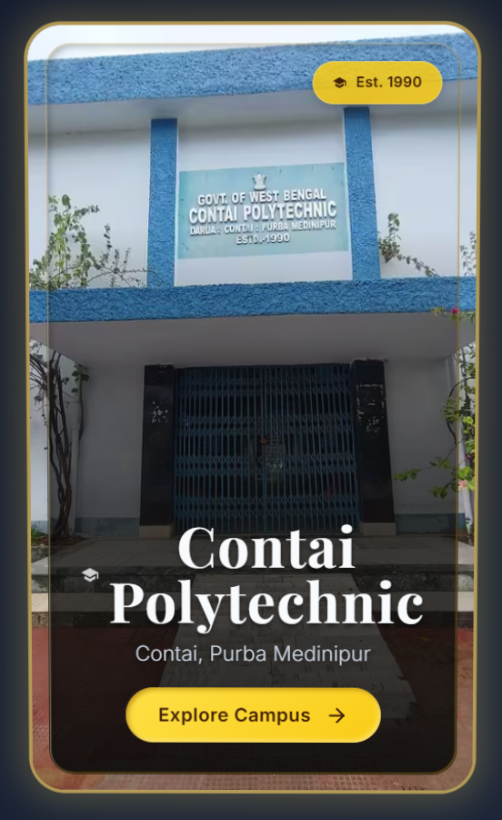

## 📚 Contai Polytechnic 3D Tilt Card

This project is a modern, elegant, interactive card component for showcasing Contai Polytechnic. Built with HTML, CSS (including Tailwind CSS for utility-first styling), custom fonts, and Vanilla Tilt.js for a smooth 3D parallax hover effect.

## 🎯 Project Overview

The card displays:

  •📸 A background image of Contai Polytechnic.

  •🏷️ An establishment badge (Est. 1990).

  •🎓 The college name and location.

  •🔗 A CTA button (“Explore Campus”) linking to the college profile.

## 🚀 Features

  ✅ Responsive Design — Looks great on mobile and desktop.

  ✅ 3D Parallax Tilt Effect — Smooth mouse tilt with glare, scale, and depth layers.

  ✅ Elegant Typography — Combines classic serif display with modern sans-serif.

  ✅ Interactive Call-to-Action — Button with hover/active states.

  ✅ Subtle Glassmorphism — Inner border and gradient overlays.

  ✅ Easy to Customize — Update image, colors, and text with minimal changes.

## 💡 Screenshots

## 🖥️ live Preview

## 📌 How It Works

  -The card container has a background image.

  -Vanilla Tilt applies 3D transform on mouse hover.

  -Internal layers (inner-border-overlay, gradient-overlay, text-block, badge, button) have different translateZ values for layered depth.

  -Smooth transitions & shadows create a premium card feel.

  -The Explore Campus button links to the official college profile.

## 🧩 Technologies Used

 HTML5 ,Tailwind CSS CDN ,Google Fonts ,Inter, Playfair Display, Vanilla Tilt.js, CSS Custom Styles

## 🔗 External Resources

  • Tailwind CSS CDN: for utility-first styling.

  • Google Fonts: Inter and Playfair Display are loaded via <link>.

  • Vanilla Tilt.js: added via CDN for the 3D effect.

## 🖼️ Customizing

  • ✅ To change the background image:
   Edit the background-image in the inline style on .card-container.

     

     
  • ✅ To change text:
   Update:

 - <h1>for the college name.

 - 
 for location.

 - .establishment-badge for the year.

 - The CTA <a> for the link text & URL.

  • ✅ To adjust tilt behavior:
   Edit the data-tilt attributes:

     data-tilt-max="10" 
     data-tilt-speed="500" 
     data-tilt-perspective="1800" 
     data-tilt-glare 
     data-tilt-max-glare="0.1" 
     data-tilt-scale="1.03"
     
## ⚙️ How to Use

1️⃣ Copy the HTML code to your .html file.

2️⃣ Open in a modern web browser.

3️⃣ Hover over the card to see the tilt effect.

4️⃣ Click Explore Campus to visit the linked page.

## 🧑‍💻 Author

Akash Pramanik

## 📝 License

This is a simple front-end component. Use it freely for educational, personal, or institutional projects.
